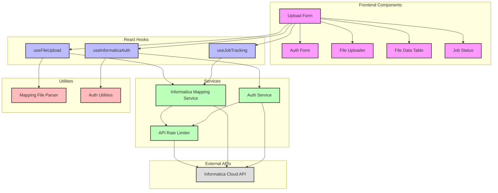

# Application Architecture

This document provides an overview of the IDMC Metadata Upload application's architecture, including component relationships and data flow.

## Architecture Diagram

## Component Descriptions

### Frontend Components

- **UploadForm**: The main container component that orchestrates the entire upload process.
- **AuthForm**: Handles user authentication with Informatica Cloud.
- **FileUploader**: Manages file selection and initial validation.
- **FileDataTable**: Displays the parsed file data and provides batch processing capabilities.
- **JobStatus**: Shows the status of submitted jobs.

### React Hooks

- **useFileUpload**: Manages file upload state and operations.
- **useInformaticaAuth**: Handles authentication state and operations.
- **useJobTracking**: Tracks the status of submitted jobs.

### Services

- **ApiRateLimiter**: Ensures API calls don't exceed Informatica Cloud's rate limits.
- **InformaticaMappingService**: Handles communication with Informatica Cloud's mapping APIs.
- **AuthService**: Manages authentication with Informatica Cloud.

### Utilities

- **MappingFileParser**: Parses Excel and CSV files into structured data.
- **AuthUtils**: Provides authentication utility functions.

## Data Flow

1. **Authentication Flow**:

   - User enters credentials in AuthForm
   - useInformaticaAuth hook calls AuthService
   - AuthService authenticates with Informatica Cloud API
   - Authentication token is stored for future API calls

2. **File Upload Flow**:

   - User selects a file in FileUploader
   - File is validated and parsed by MappingFileParser
   - Parsed data is displayed in FileDataTable
   - User can submit individual rows or batches

3. **API Call Flow**:
   - All API calls go through ApiRateLimiter
   - ApiRateLimiter queues calls if rate limits are approached
   - InformaticaMappingService sends mapping data to Informatica Cloud
   - Job status is tracked by useJobTracking

## State Management

The application uses React's built-in state management with hooks. Each major feature has its own custom hook:

- **useFileUpload**: Manages file state, validation, and upload operations
- **useInformaticaAuth**: Manages authentication state
- **useJobTracking**: Manages job tracking state

This approach provides clean separation of concerns while keeping related state and logic together.

## Error Handling

Error handling is implemented at multiple levels:

1. **Component Level**: UI components display appropriate error messages
2. **Hook Level**: Custom hooks catch and process errors
3. **Service Level**: Services implement retry logic and error normalization
4. **API Level**: ApiRateLimiter handles API failures and retries

## Performance Considerations

- **Batch Processing**: Large uploads are processed in batches
- **Rate Limiting**: API calls are rate-limited to prevent throttling
- **Optimistic Updates**: UI updates optimistically before API calls complete
- **Lazy Loading**: Components are loaded only when needed
