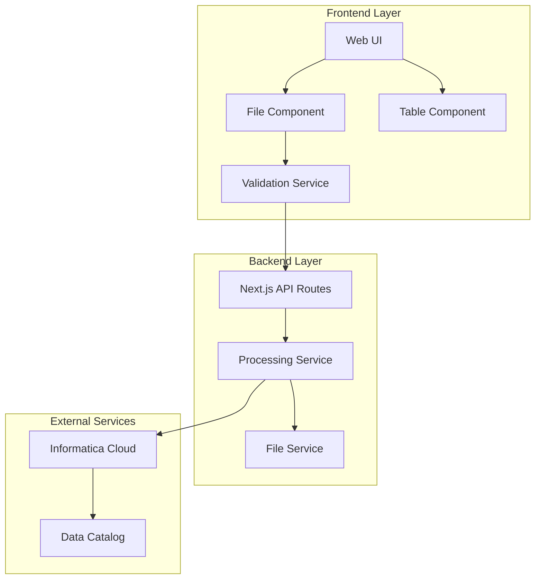
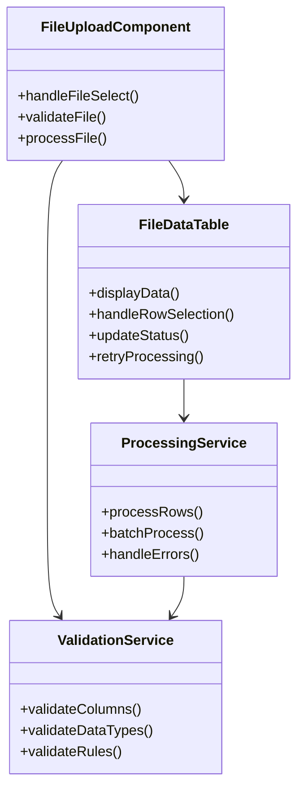
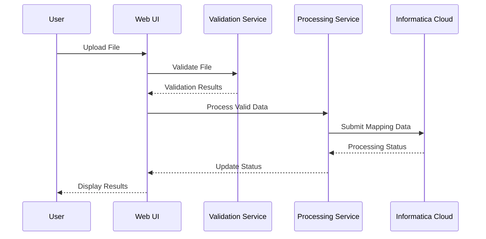
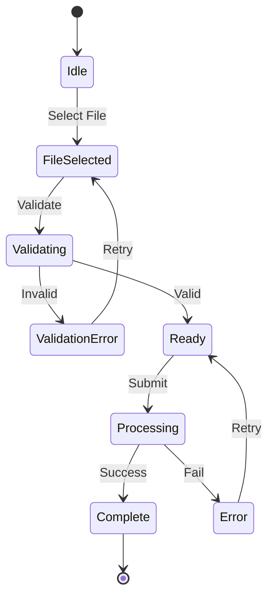
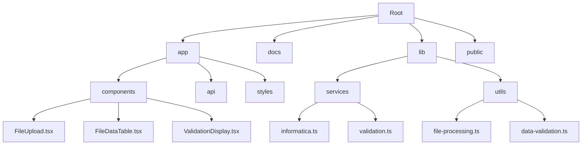
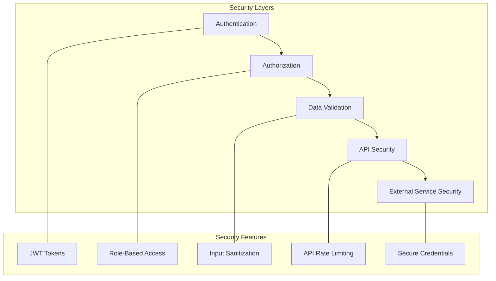
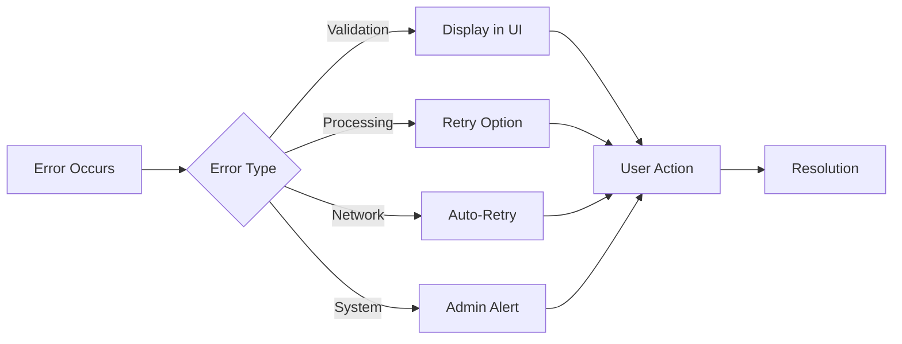
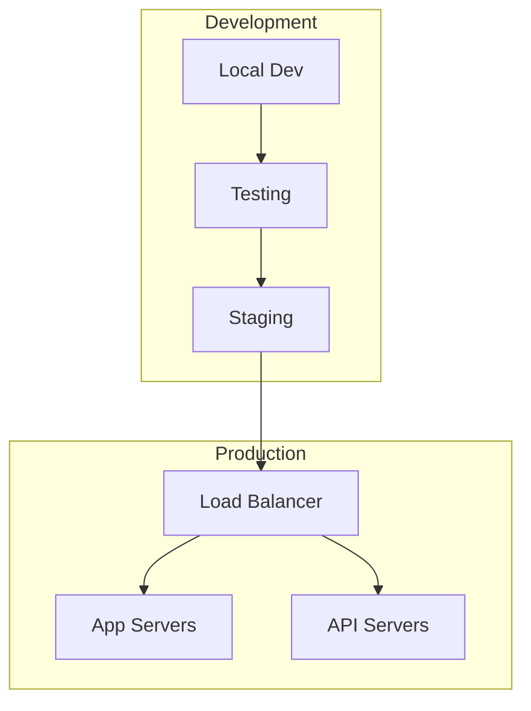
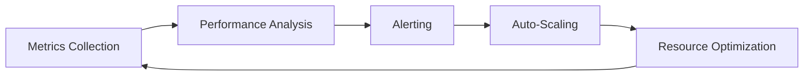

# IDMC Metadata Upload Architecture

This document outlines the architecture of the IDMC Metadata Upload application, including component relationships, data flow, and system interactions.

## System Overview

## Component Architecture

## Data Flow

## State Management

## Directory Structure

## Security Architecture

## Error Handling Flow

## Deployment Architecture

## Performance Monitoring

## Integration Points

The application integrates with several external systems and services:

1. **Informatica Cloud API**
   - Authentication
   - Data Catalog operations
   - Job monitoring

2. **File Processing**
   - Excel file parsing
   - CSV processing
   - Data validation

3. **User Management**
   - Authentication
   - Authorization
   - Session management

## Performance Considerations

- File size limits: 10MB
- Batch processing: 100 rows recommended
- API rate limiting: 100 requests per minute
- Auto-retry logic for failed operations
- Caching for frequently accessed data

## Security Measures

1. **Authentication**
   - JWT-based authentication
   - Session management
   - Secure credential storage

2. **Authorization**
   - Role-based access control
   - Feature-based permissions
   - API endpoint protection

3. **Data Security**
   - Input validation
   - Data sanitization
   - Secure transmission

## Monitoring and Logging

The application implements comprehensive monitoring and logging:

1. **Application Metrics**
   - Request/response times
   - Error rates
   - Processing success rates

2. **System Metrics**
   - CPU usage
   - Memory utilization
   - Network performance

3. **Business Metrics**
   - File processing volumes
   - Success/failure rates
   - User activity

## Scaling Strategy

The application is designed to scale horizontally:

1. **Application Layer**
   - Multiple app instances
   - Load balancing
   - Session management

2. **Processing Layer**
   - Batch processing
   - Queue management
   - Resource allocation

3. **Storage Layer**
   - Distributed caching
   - File storage optimization
   - Database scaling
